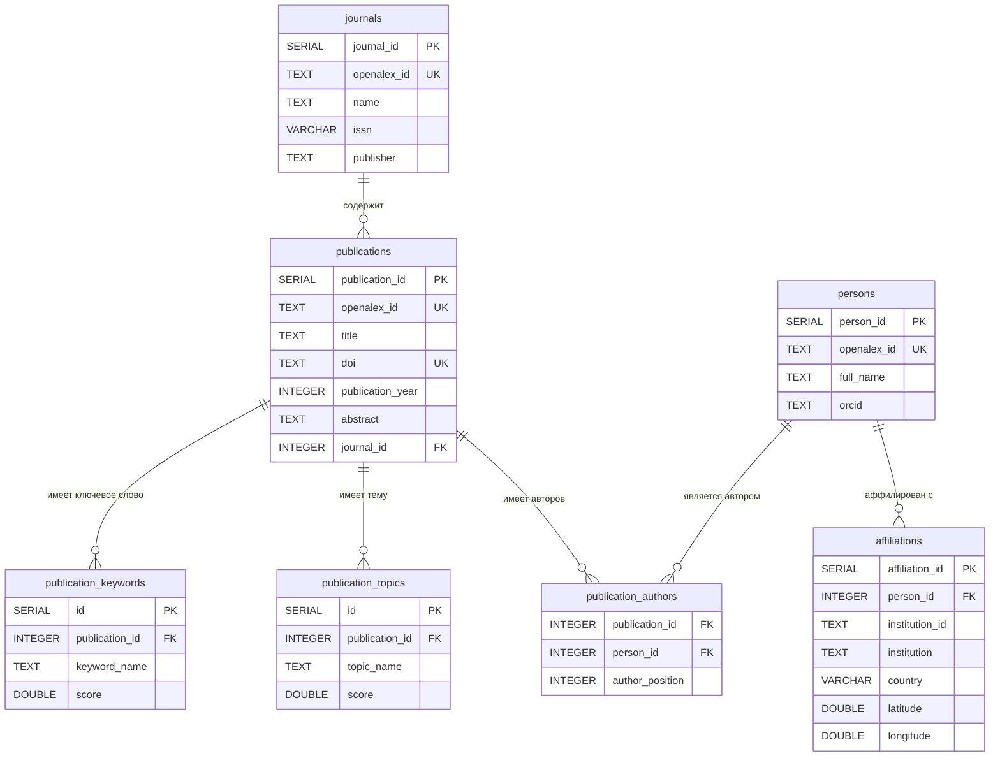

# Структура ВКР: Визуализация науки на основе метаданных публикаций и журналов

---

## Введение

### Актуальность

Объём научных публикаций удваивается каждые 9 лет. По данным OpenAlex, в открытом доступе находится более 250 миллионов научных работ. Традиционные методы поиска позволяют найти конкретную статью, но не дают ответа на более широкие вопросы: кто с кем сотрудничает, какие организации лидируют в исследованиях по теме, как тематика менялась со временем.

Визуализация метаданных научных публикаций позволяет решить эту задачу: превратить неструктурированный поток статей в наглядную карту научного ландшафта — с географией, авторскими связями и тематическими кластерами.

### Постановка задачи

**Цель:** разработать веб-систему для анализа и визуализации научных публикаций на основе метаданных из открытых источников.

**Задачи:**
- Загрузить метаданные публикаций из API OpenAlex
- Разработать реляционную базу данных PostgreSQL для хранения данных
- Геокодировать аффилиации авторов для отображения на карте
- Реализовать интерактивную карту географического распределения публикаций
- Реализовать граф связей: публикации — авторы — журналы — темы — аффилиации
- Разработать REST API и веб-интерфейс для доступа к данным

### Что анализируется

Объект исследования — **метаданные научных публикаций и журналов**: названия, авторы, год выхода, аффилиации авторов, темы, ключевые слова и DOI. Данные получены из открытого каталога [OpenAlex](https://openalex.org), который агрегирует информацию о более чем 250 миллионах научных работ.

Метаданные не включают полные тексты статей — анализируются только структурированные описания публикаций, достаточные для выявления связей между участниками научного процесса.

### Зачем нужна визуализация

Научные публикации существуют в виде разрозненных записей. Без инструментов анализа сложно ответить на вопросы:

- Какие авторы работают в смежных областях?
- Из каких стран и организаций приходят исследования по теме?
- Как связаны журналы, авторы и тематические направления?

Визуализация решает эту задачу:

| Инструмент | Что показывает |
|---|---|
| **Карта** | Географическое распределение аффилиаций авторов — откуда в мире ведутся исследования |
| **Граф связей** | Связи между публикациями, авторами, журналами и темами — кто с кем работает и что изучает |

Таким образом, система позволяет перейти от плоского списка статей к структурированному представлению научного ландшафта по выбранной теме.

---

## I. Выкачка данных из OpenAlex

### Описание

Данные о публикациях и журналах загружаются из открытого API [OpenAlex](https://openalex.org) — бесплатного каталога научных работ.

Схема взаимодействия:
```
[OpenAlex API] → [scripts/import.py] → [article_data.json] → [openalex_data/]
```

### Скрипт загрузки: `scripts/import.py`

Загружает публикации через эндпоинт `/works`, постранично (до 200 записей на страницу, до 50 страниц). Для каждой публикации извлекается:
- название, год, DOI
- журнал (`primary_location.source.display_name`)
- авторы и их аффилиации
- темы и ключевые слова

Запуск:
```bash
python scripts/import.py
```

Результат сохраняется в `article_data.json` (полные данные) и `article_summary.txt` (текстовая сводка).

### Пример данных (журнал → публикации)

```json
[
  {
    "journal": "Nature",
    "articles": [
      {
        "id": "W2741809807",
        "display_name": "Attention is all you need",
        "publication_year": 2017,
        "primary_topic": { "display_name": "Neural Machine Translation" },
        "authorships": [
          {
            "author": { "display_name": "Ashish Vaswani" },
            "institutions": [
              { "display_name": "Google Brain", "id": "I1299303" }
            ]
          }
        ]
      }
    ]
  }
]
```

---

## II. База данных

### ER-диаграмма



### Описание таблиц и связей

| Таблица | Назначение | Ключевые поля |
|---|---|---|
| `journals` | Научные журналы | `journal_id`, `openalex_id`, `name` |
| `publications` | Публикации | `publication_id`, `title`, `journal_id` (FK → journals) |
| `persons` | Авторы | `person_id`, `full_name`, `orcid` |
| `affiliations` | Организации авторов с геокоординатами | `person_id` (FK → persons), `latitude`, `longitude` |
| `publication_authors` | Связь публикация ↔ автор | `publication_id` (FK), `person_id` (FK), `author_position` |
| `publication_topics` | Темы публикаций (из OpenAlex) | `publication_id` (FK), `topic_name`, `score` |
| `publication_keywords` | Ключевые слова публикаций | `publication_id` (FK), `keyword_name`, `score` |

**Связи:**
- `journals` → `publications`: один журнал содержит много публикаций (1:N)
- `publications` ↔ `persons`: многие публикации имеют многих авторов (N:M через `publication_authors`)
- `persons` → `affiliations`: один автор может иметь несколько аффилиаций (1:N)
- `publications` → `publication_topics`: одна публикация — несколько тем (1:N)
- `publications` → `publication_keywords`: одна публикация — несколько ключевых слов (1:N)

### Скрипты создания и загрузки БД

**Создание схемы:**
```bash
creatdb -U postgres openalex_db
psql -U postgres -d openalex_db -f database/db.sql
```

**Загрузка данных из JSON в PostgreSQL:**
```bash
python database/setup_pg_database.py
```

Скрипт `database/setup_pg_database.py` читает JSON-файлы из `openalex_data/` и заполняет таблицы БД.

**Блок-схема загрузки данных в БД:**
```
[article_data.json]
        │
        ▼
[setup_pg_database.py]
        │
        ├──► journals          (INSERT OR IGNORE по openalex_id)
        │
        ├──► publications      (INSERT, journal_id из journals)
        │
        ├──► persons           (INSERT OR IGNORE по openalex_id)
        │
        ├──► affiliations      (INSERT для каждой организации автора)
        │
        ├──► publication_authors (INSERT связи публикация↔автор)
        │
        ├──► publication_topics  (INSERT тем)
        │
        └──► publication_keywords (INSERT ключевых слов)
```

---

## III. Географическая привязка

### Что такое геоданные

**Геоданные** — это данные, содержащие географическую привязку: координаты (широта и долгота), названия мест, страны, регионы.

В контексте данного проекта геоданные — это координаты организаций, в которых работают авторы публикаций. Они позволяют отобразить точку на карте мира для каждой аффилиации.

| Понятие | Пример |
|---|---|
| Аффилиация | «MIT, Cambridge, USA» |
| Широта (latitude) | 42.3601 |
| Долгота (longitude) | −71.0942 |
| Результат | Точка на карте в Бостоне |

Координаты не хранятся в OpenAlex напрямую вместе с публикациями — их нужно получать отдельно через API организаций (`/institutions`) или геокодер по названию.

### Задача

Для каждой аффилиации (организации автора) необходимо получить географические координаты (широта, долгота), чтобы отобразить их на карте.

### Проблемы

| Проблема | Причина | Решение |
|---|---|---|
| Не все аффилиации имеют `institution_id` | OpenAlex не всегда возвращает ID организации | Пропускаются при геокодировании |
| Лимиты API OpenAlex | Не более 10 запросов/сек (polite limit) | Пауза 0.5 сек между батчами (`PAUSE = 0.5`) |
| Один автор — несколько организаций | Авторы могут работать в нескольких местах | Сохраняются все аффилиации |
| Координаты отсутствуют у части организаций | OpenAlex не всегда имеет geo-данные | Fallback: Nominatim (OpenStreetMap) |
| Дублирование координат | Разные записи одной организации | Дедупликация по `(place, lat, lon)` |

### Блок-схема геокодирования

```
[affiliations в БД]
        │
        ▼
[Получить уникальные institution_id]
        │
        ▼
[Загрузить кэш geo_cache.json]
        │
        ▼
[Для каждого ID не в кэше]
        │
        ├──► [Запрос к OpenAlex /institutions]
        │           │
        │     успех ├──► [lat/lon → кэш]
        │     ошибка └──► [null → кэш (пропустить)]
        │
        ▼
[Обновить affiliations SET latitude, longitude]
        │
        ▼
[Для оставшихся без координат]
        │
        ▼
[Запрос к Nominatim по названию организации]
        │
        ▼
[affiliation_geo_cache.json + обновление БД]
```

Скрипты:
- `geocoding/fetch_geo.py` — геокодирование через OpenAlex API
- `geocoding/fetch_geo_nominatim.py` — fallback через Photon/Nominatim (OpenStreetMap)

### Откуда берутся геоданные

Геокодирование выполняется в два этапа из двух разных источников:

**Этап 1 — OpenAlex `/institutions` API (`fetch_geo.py`)**

Для каждой организации, у которой есть `institution_id` в OpenAlex, делается запрос:
```
GET https://api.openalex.org/institutions?filter=ids.openalex:I123|I456|...&select=id,geo
```
За один запрос можно передать до 100 ID (`BATCH_SIZE = 100`). Между батчами — пауза 0.5 секунды, чтобы не превысить лимит API. Из ответа берётся поле `geo.latitude` и `geo.longitude`.

**Этап 2 — Photon (OpenStreetMap) (`fetch_geo_nominatim.py`)**

Для аффилиаций без `institution_id` (организация записана только строкой, без ссылки на OpenAlex) используется геокодер **Photon** от Komoot:
```
GET https://photon.komoot.io/api/?q=<название организации>&limit=1
```
Photon — бесплатный геокодер на базе данных OpenStreetMap. Скрипт пробует сначала полное название, затем последние 3 части через запятую, затем 2 части — пока не получит координаты. Пауза между запросами — 0.3 сек.

**Приоритет обработки:**

Скрипт сначала обрабатывает организации, которые «разблокируют» наибольшее количество публикаций без геоданных — то есть те, чьё геокодирование даст наибольший прирост покрытия карты.

**Кэширование:**

| Файл | Содержимое |
|---|---|
| `openalex_data/geo_cache.json` | Координаты по `institution_id` из OpenAlex |
| `openalex_data/nominatim_cache.json` | Координаты по строке названия из Photon |

При повторном запуске скрипты не делают повторных запросов для уже закэшированных записей.

---

## IV. Визуализация данных

### Интерфейс: `interface/VKR1.html`

Веб-приложение с четырьмя основными разделами:

| Вкладка | Содержимое |
|---|---|
| Карта | Географическое распределение публикаций по аффилиациям авторов |
| Граф | Граф связей: публикации, авторы, журналы, темы |
| Таблица | Список публикаций с фильтрацией и поиском |
| Статистика | Счётчики: публикации, журналы, авторы, аффилиации |

### Технологии

- **Plotly** — интерактивная карта (scatter_geo)
- **SVG + D3-подобный рендеринг** — граф связей (реализован вручную на JavaScript)
- **Собственный сервер** (`openalex_server.py`) — REST API на Python

### API сервера

| Эндпоинт | Описание |
|---|---|
| `GET /api/articles` | Список всех публикаций с авторами, темами, аффилиациями |
| `GET /api/article/{id}` | Детали публикации (abstract, doi) |
| `GET /api/stats` | Счётчики по таблицам |
| `GET /api/data-tables` | Полные данные всех таблиц + граф |

---

## V. Граф связей

### Как построен граф

Граф строится на стороне браузера — сервер отдаёт данные, клиент сам вычисляет узлы и рёбра и рисует их в SVG.

**Типы узлов:**

| Тип | Цвет | Что означает |
|---|---|---|
| Год | Тёмно-зелёный | Год публикации |
| Журнал | Светло-зелёный | Название журнала |
| Статья | Белый | Публикация |
| Автор | Бежевый | Имя автора |
| Аффилиация | Зелёный (бледный) | Организация автора |

**Режимы отображения:**

| Режим | Колонки | Описание |
|---|---|---|
| Полный граф | Год → Журнал → Статья → Автор → Аффилиация | Все связи сразу |
| Годы + журналы + статьи | Год → Журнал → Статья | Хронологическая структура |
| Авторы | Статья → Автор | Кто написал что |
| Аффилиации | Статья → Аффилиация | География соавторства |
| Похожие статьи | Статья — Статья | Связи по сходству |

**Алгоритм размещения узлов:**

Граф использует **колоночную раскладку** (не физическую симуляцию): каждый тип узла помещается в свою вертикальную колонку. Позиция по вертикали вычисляется равномерно по количеству узлов в колонке. Рёбра — кривые линии (`SVG path`) между центрами узлов. При клике на узел — подсветка и показ деталей в правой панели.

Ограничение: одновременно отображается не более **70 статей** для сохранения читаемости графа.

---

## VI. Поиск похожих статей

### Алгоритм

Для каждой пары статей вычисляется **взвешенный балл сходства**:

```
score = (общих авторов × 4)
      + (общих тем × 3)
      + (общих ключевых слов × 2)
      + (общих аффилиаций × 2)
      + (один журнал → +2)
```

| Признак | Вес | Обоснование |
|---|---|---|
| Общие авторы | 4 | Самый сильный признак — один и тот же человек пишет связанные работы |
| Общие темы | 3 | Тематическая близость — второй по важности признак |
| Общие ключевые слова | 2 | Уточняющий признак |
| Общие аффилиации | 2 | Соавторство из одной организации |
| Один журнал | 2 | Публикуются в одном издании |

Если `score = 0` — статьи не связаны и не отображаются в списке похожих.

### Нормализация при сравнении

Перед сравнением строки приводятся к нижнему регистру и обрезаются пробелы (`normalizeText`), чтобы избежать ложных несовпадений из-за регистра.

### Где используется

- **Правая панель** — при клике на статью показывает список похожих, отсортированный по убыванию балла, с пояснением причин сходства
- **Режим графа "Похожие статьи"** — рёбра между статьями с весом `score`, подписи на рёбрах

### Запуск

```bash
# Windows
start_openalex_server.bat

# Или напрямую
python openalex_server.py
```

После запуска открыть: [http://127.0.0.1:8000](http://127.0.0.1:8000)

---

## VII. Возникшие проблемы

В ходе разработки проекта возник ряд технических трудностей. Ниже описаны основные проблемы и способы их решения.

### 1. Превышение лимита размера файла на GitHub

**Проблема:** файл `article_data.json` с загруженными данными из OpenAlex весил 201 МБ, что превышает максимально допустимый размер файла на GitHub (100 МБ). При попытке сделать `git push` операция завершалась ошибкой.

**Решение:** файл удалён из истории репозитория с помощью `git filter-branch`, добавлен в `.gitignore`. Для хранения данных используется дамп базы данных (`dump.sql`).

---

### 2. Конфликты при слиянии веток

**Проблема:** при работе с несколькими ветками возникали конфликты слияния в файлах `vkr1_app.js`, `СТРУКТУРА_ВКР.md` и других. Git не мог автоматически определить, какую версию оставить.

**Решение:** конфликты разрешались вручную командой `git checkout --theirs` для принятия актуальной версии из удалённого репозитория.

---

### 3. Ошибка ConnectionAbortedError при загрузке данных

**Проблема:** при обращении к `/api/articles` браузер разрывал соединение с ошибкой `ConnectionAbortedError: [WinError 10053]`. Причина — слишком большой объём JSON-ответа (несколько мегабайт), который браузер не успевал принять.

**Решение:** добавлена gzip-компрессия ответов в `openalex_server.py`. Если клиент передаёт заголовок `Accept-Encoding: gzip`, сервер сжимает данные перед отправкой. Размер ответа уменьшился в 5–10 раз.

---

### 4. Нехватка места на диске

**Проблема:** в процессе работы с git на Windows несколько раз заканчивалось место на диске (0 байт свободно). Операции `git add`, `git commit` и даже запись временных файлов завершались ошибкой `Out of diskspace`.

**Решение:** освобождение места путём очистки временных файлов Windows (`%temp%`). После этого git-операции выполнялись в штатном режиме.

---

### 5. Отсутствие геоданных у части аффилиаций

**Проблема:** не все организации в OpenAlex имеют `institution_id` — часть аффилиаций записана только строкой названия без ссылки. Для таких записей запрос к `/institutions` API невозможен.

**Решение:** реализован fallback через геокодер **Photon** (OpenStreetMap): запрос по строке названия организации. Скрипт пробует несколько вариантов сокращения строки, пока не получит координаты.

---

### 6. Кодировка при запуске на Windows

**Проблема:** при запуске Python-скриптов на Windows возникали ошибки кодировки (`UnicodeDecodeError`) из-за несовместимости кодировок cp1251 и UTF-8 в PostgreSQL и системных библиотеках.

**Решение:** явное указание `client_encoding: utf8` в конфигурации подключения к БД (`pg_config.py`) и принудительная перекодировка вывода через `sys.stdout.reconfigure(encoding='utf-8')`.
